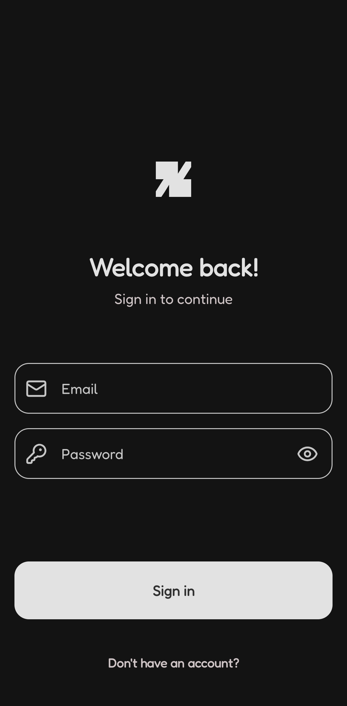
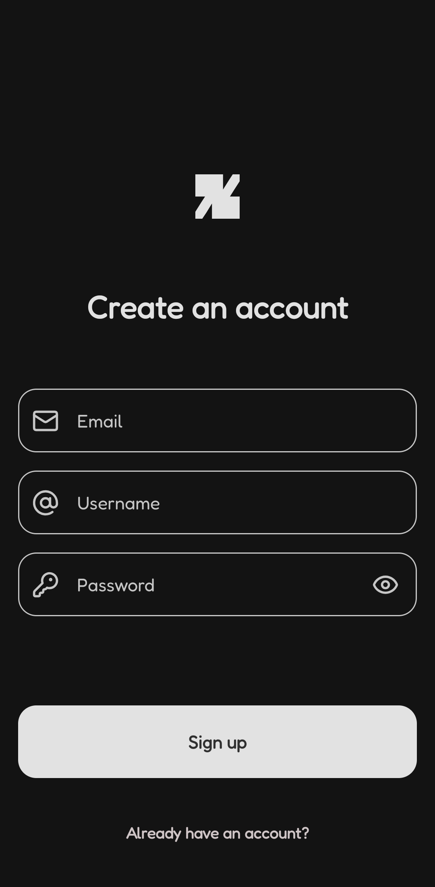
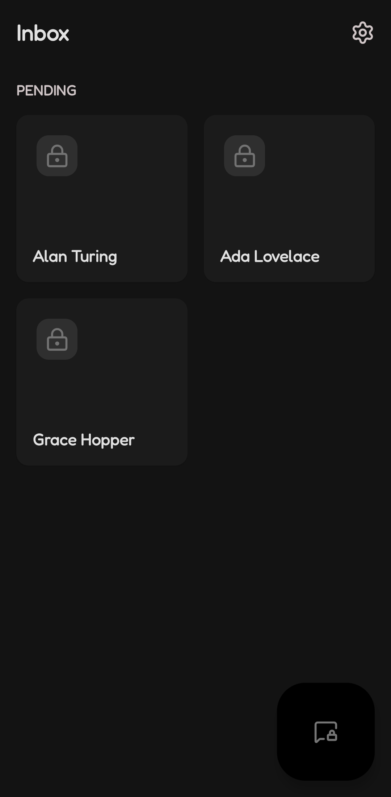
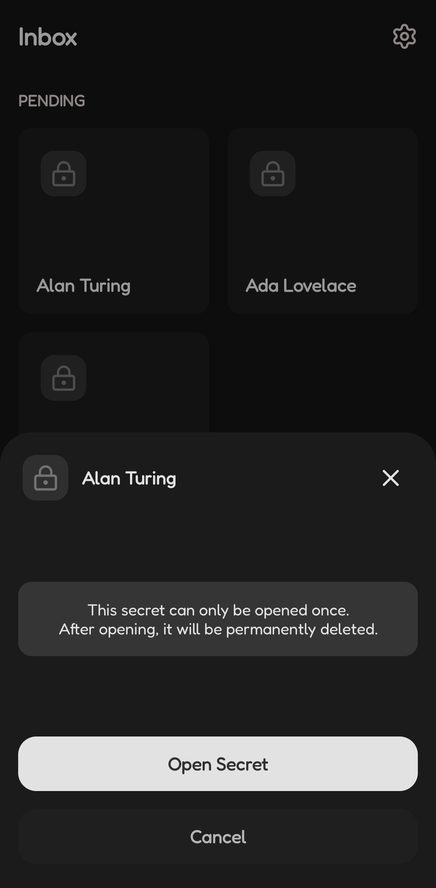
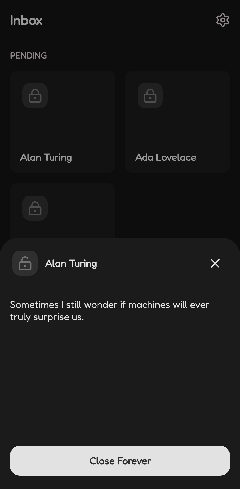
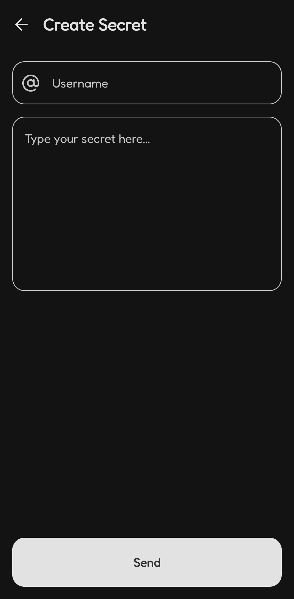
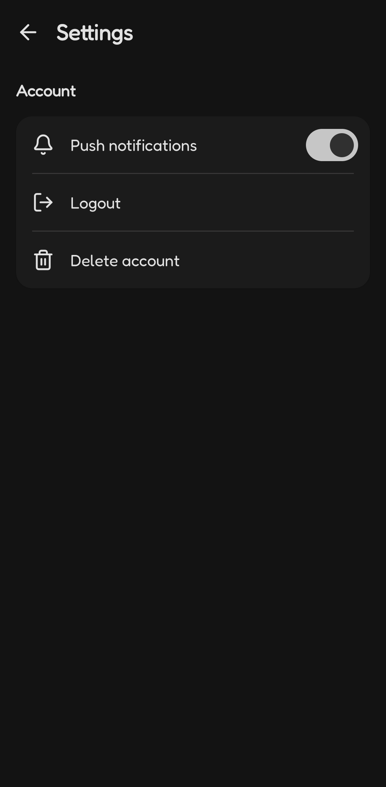

# KIS (Keep It Secret)

KIS is an ephemeral messaging app designed to send "secrets" that are automatically deleted once read.
It ensures that messages do not remain stored in the database after being consumed by the recipient.

## Features
- **Registration and Login:** User authentication using email and password.
- **Username Identification:** Users are identified by a username to receive secrets.
- **Send Secrets:** Interface to compose and send direct messages to other users.
- **Secrets Inbox:** List of received secrets pending to be read.
- **Single Read (Self-Destruct):** Secrets are permanently deleted from the database immediately after being opened and closed by the recipient.

## Screenshots
|                                              |                                              |
|:--------------------------------------------:|:--------------------------------------------:|
|  |  |
|  |  |
|  |  |
|  |                                              |

## Installation
### From Source Code
1. Clone this repository:
    ```bash
    git clone https://github.com/cabovianco/android-kis-app.git
    ```
2. Open the project in Android Studio.
3. Add your own `google-services.json` file (Firebase project configuration) to the `app/` directory.
4. Build and run the app on your device or emulator.

## Technologies
- **Platform & Language:** Android, Kotlin.
- **Architecture:** Clean Architecture, MVVM, UDF (Unidirectional Data Flow).
- **UI:** Jetpack Compose, Material 3.
- **Data & Concurrency:** Firebase Firestore, Firebase Auth, Kotlin Coroutines, Kotlin Flow, Kotlin Serialization.
- **Monitoring:** Firebase Crashlytics, Firebase Analytics.
- **Dependency Injection:** Dagger Hilt.
- **Navigation:** Navigation Compose.

## App Structure
The app follows **Clean Architecture** principles, organized into the following package structure:

```text
com.cabovianco.kis
├── data/                   # Implementation of data sources
│   └── remote/
│       └── firebase/
│           ├── firestore/  # Firestore documents and collections
│           └── repository/ # Repository implementations
│
├── di/                     # Dependency Injection modules
│
├── domain/                 # Business logic
│   ├── model/              # Domain entities
│   ├── repository/         # Repository interfaces
│   └── usecase/            # Domain operations
│
└── presentation/           # UI Layer
    ├── event/              # Events
    ├── navigation/         # Screen definitions and NavHost
    ├── state/              # States
    ├── ui/
    │   ├── screen/         # Screens and components
    │   └── theme/          # App theme (color, type, etc.)
    └── viewmodel/          # ViewModels
```

## Firebase Data Modeling
The Firestore structure is organized as follows:

### `users` Collection
Stores profile information for each registered user.
- **Document ID:** Firebase Auth UID.
- **Fields:**
    - `email`: User's email address.
    - `username`: Alias used to receive secrets.

### `inboxes` Collection
Manages messages received for each username.
- **Document ID:** Recipient's `username`.
- **`received` Sub-collection:** Contains individual secrets.
    - **Document ID:** Automatically generated by Firestore.
    - **Fields:**
        - `content`: The message content.
        - `from`: The sender's `username`.

## License
This project is licensed under the MIT License. See the [LICENSE](LICENSE) file for details.
